# Деплой React додатка на Akash Network

Ця інструкція буде корисна тим, хто має намір спробувати Akash Network та задеплоїти на ньому свій React-додаток.

## Щоб розпочати, вам знадобиться:

1. Редактор коду (у моїх прикладах я використовуватиму Visual Studio Code, але ви можете використовувати будь-який інший).
2. Встановлений Docker Engine (ви можете встановити його, скориставшись цією [інструкцією](https://docs.docker.com/engine/install/) на офіційному сайті Docker).
3. Реєстрація на [Docker Hub](https://hub.docker.com/)
4. Встановлений веб-гаманець [Keplr](https://help.keplr.app/articles/installation-guide-for-keplr-extension-for-beginners) або [Leap](https://www.leapwallet.io/support/how-to-set-up-leap-wallet)

## Крок 1 - Додайте файл Dockerfile у кореневу папку вашого додатка.

Для прикладу, я використовую вже готову та дещо змінену збірку Vite. Інструкцію щодо розгортання цієї збірки ви можете знайти за цим [посиланням](https://vitejs.dev/guide/)

Отже, створіть у корені вашого додатка файл під назвою Dockerfile (зверніть увагу, що для цього файлу не потрібно вказувати розширення).

Внесіть до нього наступні дані:

```
FROM node:18-alpine

WORKDIR /app

COPY package.json .

RUN npm install

COPY . .

RUN npm run build

EXPOSE 8080

CMD [ "npm", "run", "dev" ]
```

Давайте розберемося крок за кроком, що таке Dockerfile. Кожен крок у Dockerfile - це окремий шар, який створюється під час побудови образу.

```
FROM node:18-alpine
```

По-перше, ми визначаємо базове зображення, поверх якого буде запущено наш додаток, у даному випадку - Node.

```
WORKDIR /app
```

Визначаємо робочий каталог (WORKDIR), який буде активним в контейнері Docker на будь-який момент часу.

```
COPY package.json .
```

Копіюємо наш файл package.json з локальної системи до образу Docker.

```
RUN npm install
```

Виконуємо команду npm install всередині образу Docker, щоб встановити всі залежності нашого додатку.

```
COPY . .
```

Копіюємо усі інші файли з поточної директорії до образу Docker.

```
RUN npm run build
```

Нарешті, запускаємо команду npm run build, щоб створити виробничу збірку нашого додатку всередині образу Docker.

```
EXPOSE 8080
```

Крок, на якому визначено EXPOSE 8080, є конвенцією і доброю практикою, що вказує на те, на якому порту програма "повинна" працювати. Ми можемо виставити інший порт у Dockerfile та використовувати зовсім інший порт під час запуску образу.

```
CMD [ "npm", "run", "preview" ]
```

Остання команда npm run preview виконується лише під час запуску контейнера. Вона не є частиною процесу створення образу.

## Крок 2 - Створюємо Docker контейнер та завантажуємо його на Docker Hub.

Перш ніж створити контейнер Docker, вам необхідно спочатку створити образ Docker. Для цього відкрийте термінал. У моєму прикладі я буду використовувати оболонку bash. Перейдіть до кореневої папки вашого проекту і виконайте наступну команду.

```
docker build . -t "react-akash-project"
```

Наведена вище команда виконує дві речі:

- Створює образ Docker із поточного контексту (тобто з усіх файлів та папок у поточній директорії).
- Надає образу ім'я "react-akash-project".

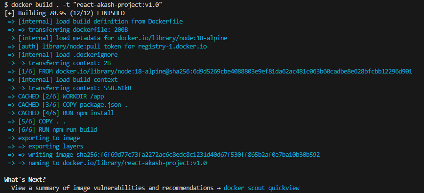

Тепер ми можемо перевірити список доступних образів Docker на нашій локальній системі, виконавши наступну команду

```
docker images
```

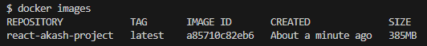

Чудово! Тепер давайте спробуємо запустити цей образ, який тепер стає контейнером. Виконайте наступну команду, щоб створити контейнер на основі образу з назвою "react-akash-project":

```
docker run -p 8080:8080 react-akash-project
```

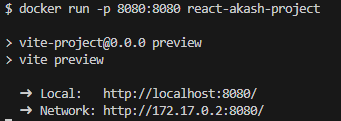

Якщо все пройде успішно, ви зможете переглянути ваш додаток, який працює всередині контейнера Docker за адресою [localhost:8080](http://localhost:8080/).

Отже, залишилося лише завантажити цей Docker образ на Docker Hub. Перш ніж завантажити образ на Docker Hub, вам потрібно правильно протегувати його. Команда для цього виглядає наступним чином:

```
docker tag image_name username/repository:tag
```

Ось як ця команда виглядатиме для мого випадку:

```
docker tag react-akash-project kapitoshko/react-akash-project:v1.0
```

Щоб завантажити образ на Docker Hub, виконайте наступну команду:

```
docker push myusername/my_image:latest
```

У мене ця команда буде мати наступний вигляд:

```
docker push kapitoshko/react-akash-project:v1.0
```

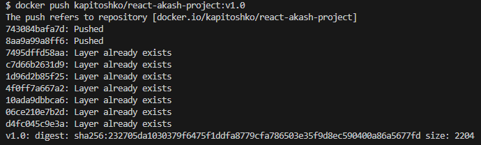

Тепер перевірте [Docker Hub](https://hub.docker.com/), щоб побачити, чи з'явився ваш образ. Переходимо до наступного кроку.

## Крок 3 - Розгортаємо наш додаток в мережі Akash.

- Перейдіть на веб-сайт [Cloudmos](https://deploy.cloudmos.io/). Щоб розгорнути свій додаток, вам потрібно мати щонайменше 0,5 AKT на своєму рахунку. Інструкції щодо того, як поповнити рахунок, можна знайти [тут] (https://akash.network/docs/getting-started/token-and-wallets/). Крім того, під час першого входу в Cloudmos створіть сертифікат у розділі "Settings". Натисніть кнопку "Create Certificate", підтвердіть всі транзакції, і сертифікат буде готовий через кілька секунд.

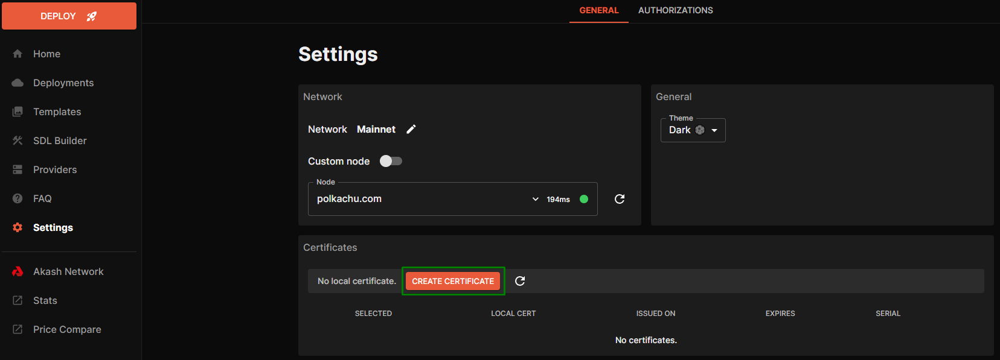

- Створіть нове розгортання, вибравши "Hello World", а потім у вкладці YAML замініть весь вміст наступним [файлом](./deploy.yml)

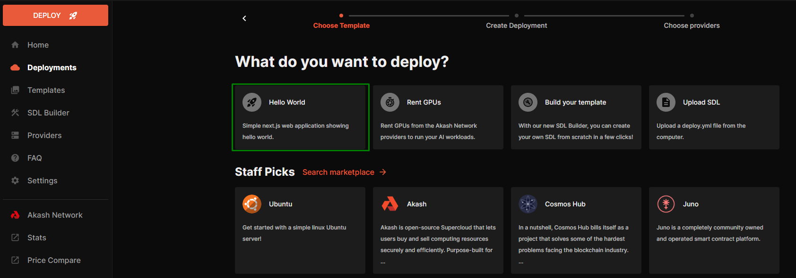

- У цьому файлі оновіть наступні поля:

  - Посилання на ваш Docker контейнер.
  - Необхідні ресурси для розгортання.

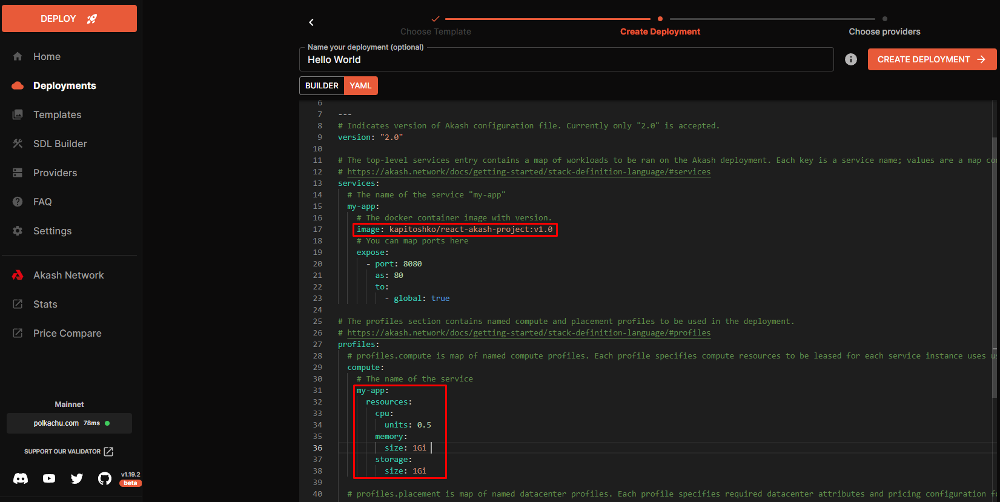

- Після внесення цих змін вам необхідно підтвердити початковий депозит для запуску розгортання, який становить 0.5 AKT. 


- Підтвердіть всі необхідні кроки.

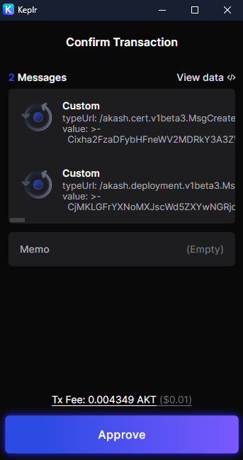

- Через деякий час ви побачите список постачальників. Виберіть того, який найбільше відповідає вашим потребам, встановіть відповідний прапорець і натисніть "ACCEPT BID".

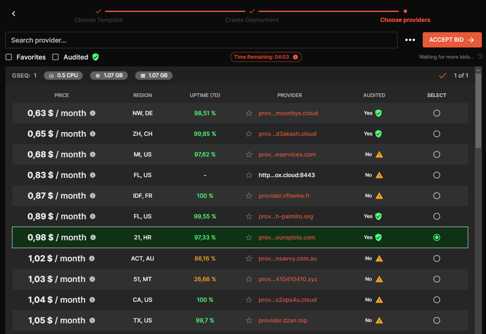

- Потім ви знову все схвалюєте. 

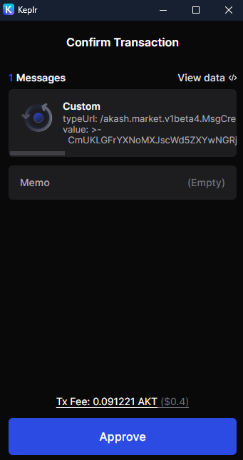

- Після цього перейдіть на вкладку EVENTS і дочекайтеся появи наступного тексту.

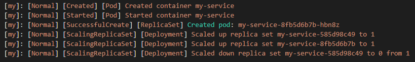

- Після цього ви переходите на вкладку LEASES, де з'явиться посилання на ваш веб-сайт.

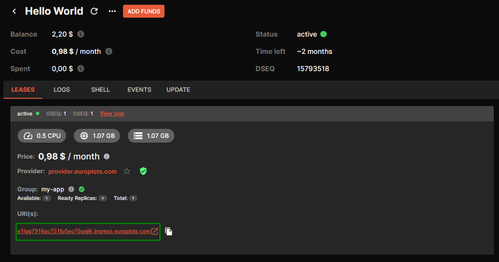

## Вітаємо, ваш додаток успішно розміщено в мережі Акаш!

### Кілька лайфхаків:

1. Якщо ви хочете спробувати можливості Akash Network, але поки що не бажаєте вносити депозит на рахунок, ви можете скористатися пісочницею. Це спеціальне середовище, де ви можете розгорнути свій додаток за тестові токени. Більше інформації про пісочницю ви можете дізнатися  [тут](https://akash.network/docs/deployments/sandbox/introduction/). Кран для отримання тестових токенів знаходиться [тут](https://faucet.sandbox-01.aksh.pw/)
2. Якщо вам невідоме використання Docker і ви не впевнені, як правильно створити Dockerfile, ви можете скористатися інструментами штучного інтелекту, такими як ChatGPT, Blackboxа або Copilot. У більшості випадків, вони зможуть вам скласти працюючий Dockerfile.
3. Якщо ви стикаєтеся з помилками при спробі розгортання додатку, спробуйте спершу закрити розгортання і запустити його на іншому провайдері. Якщо це не вирішує проблему, завжди можете звернутися за допомогою до офіційного Discord-каналу Akash Network, де вам обов'язково допоможуть.